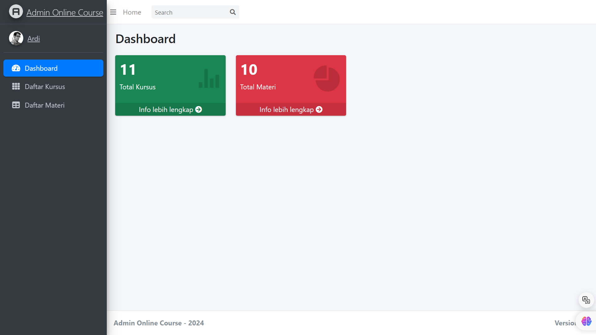
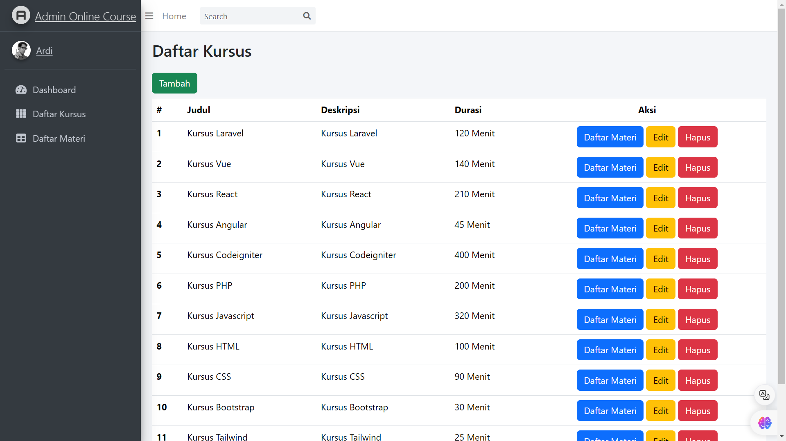
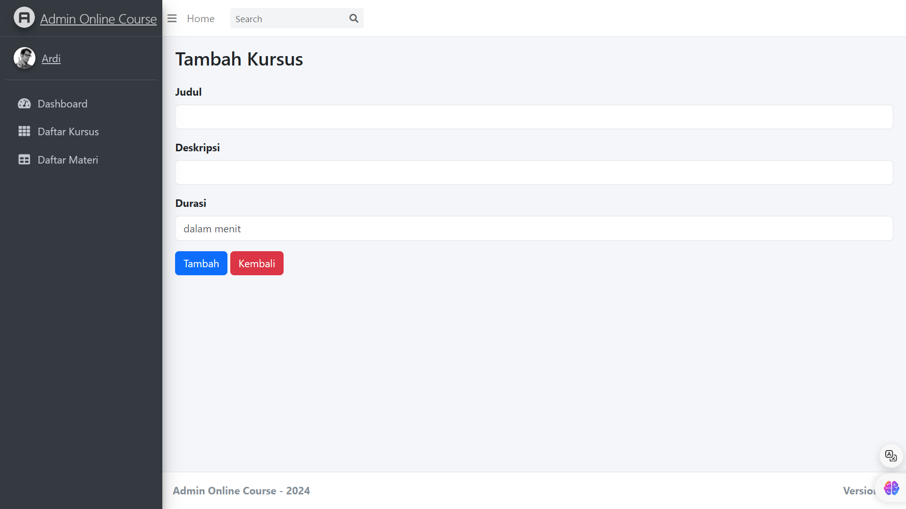
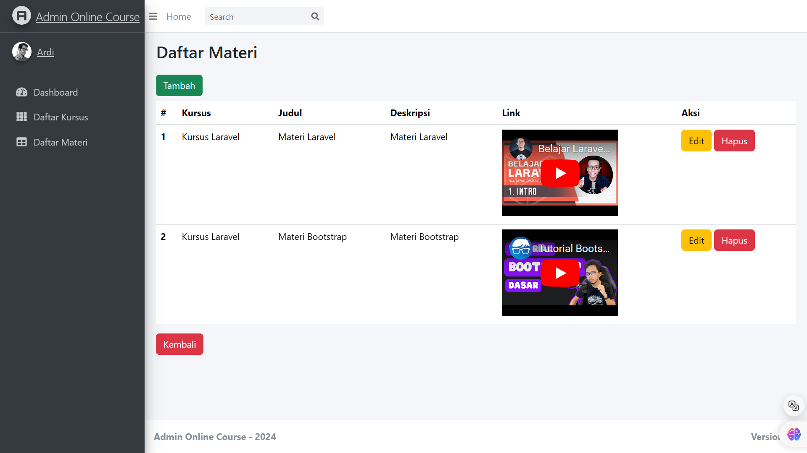
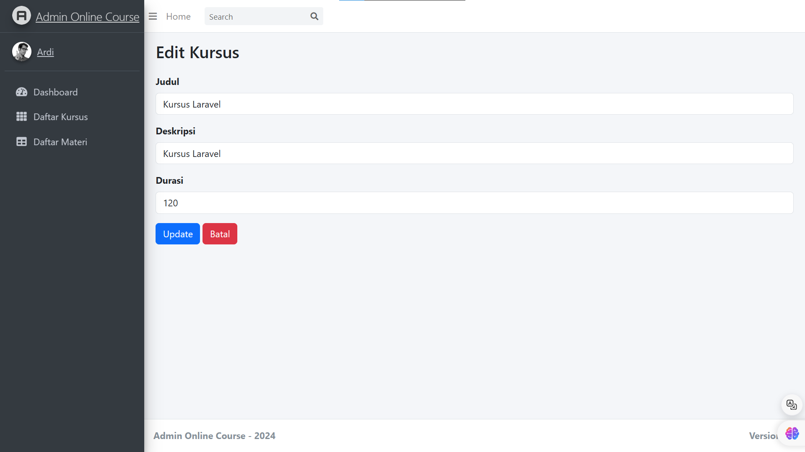
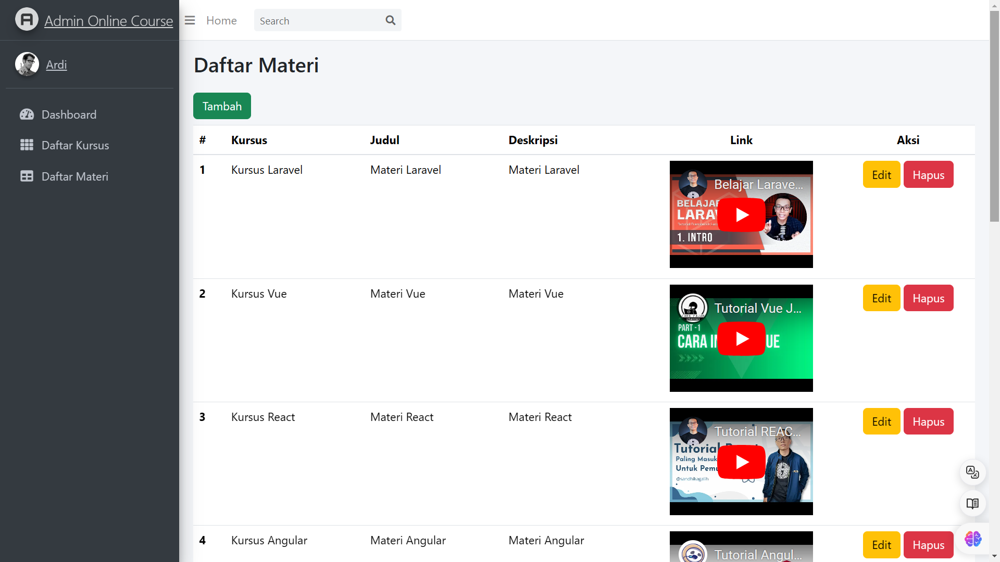
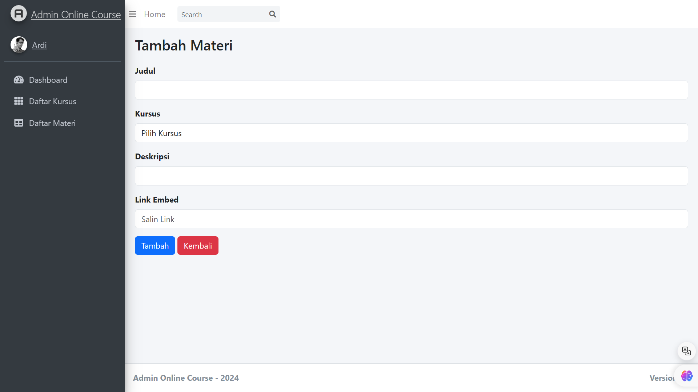
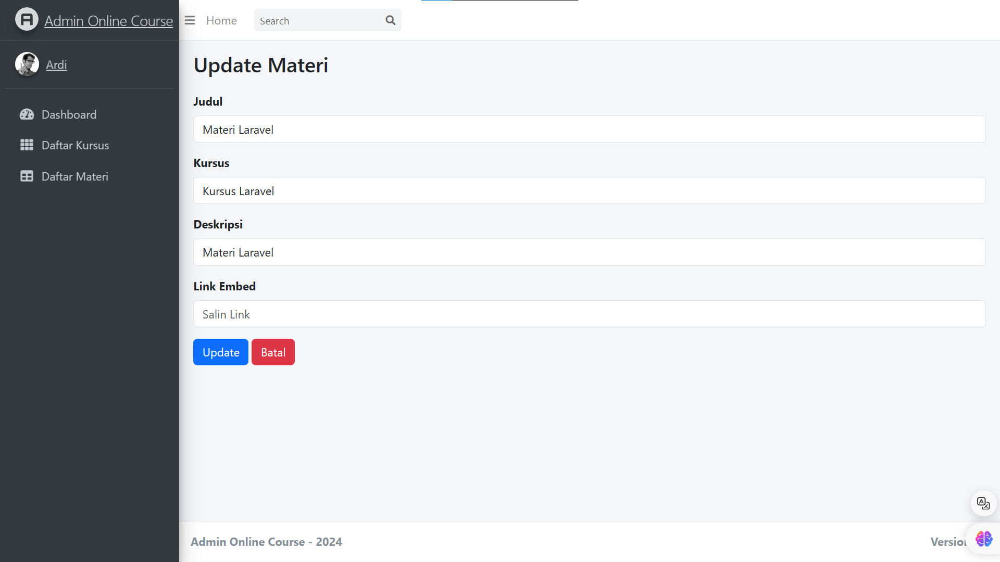
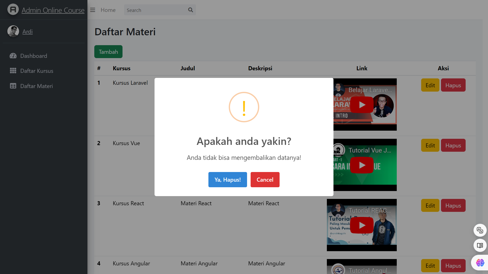

# Online Course

Aplikasi untuk Ardi seorang admin platform online course untuk mengelola kursus dan materi.

Untuk menggunakan gunakan perintah composer install

Buat database baru lalu sesuaikan dengan env, pada project saya nama databasenya laravel_online_course

Jalankan php artisan migrate --seed

Jalankan php artisan serve

Project dapat digunakan

## Screenshots

Halaman Dashboard

Halaman Daftar Kursus

Halaman Tambah Daftar Kursus

Halaman Detail Materi Kursus

Halaman Edit Kursus

Halaman Daftar Materi

Halaman Tambah Materi

Halaman Update Materi

Pop Up Hapus Materi

